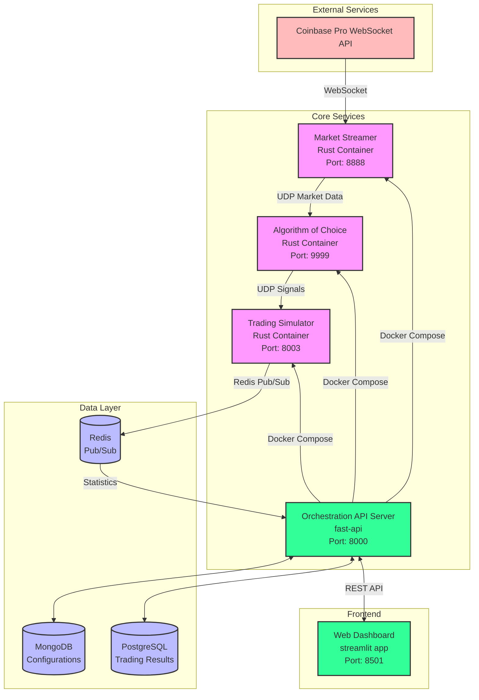

# AW-Trade: Algorithmic Trading System

A comprehensive, microservices-based algorithmic trading platform for cryptocurrency markets built with Rust and Python. This system provides real-time market data streaming, multiple trading algorithms, simulation capabilities, and a web-based management interface.

## 📋 Table of Contents

- [System Overview](#system-overview)
- [Architecture](#architecture)
- [Components](#components)
- [Technology Stack](#technology-stack)
- [Quick Start](#quick-start)
- [Configuration](#configuration)
- [Development](#development)
- [Deployment](#deployment)
- [Monitoring](#monitoring)
- [Contributing](#contributing)

## 🎯 System Overview

AW-Trade is a real-time algorithmic trading system designed for cryptocurrency markets. It follows a microservices architecture where each component handles a specific responsibility:

- **Real-time market data streaming** from exchanges (Coinbase Pro)
- **Multiple trading algorithms** (RSI, Order Book Imbalance)
- **Trading simulation** with portfolio management
- **Orchestration API** for managing simulations
- **Web dashboard** for monitoring and control
- **Persistent storage** with PostgreSQL and MongoDB

## 🏗️ Architecture



## 🧩 Components

### 1. Stream-Rust (Market Data Streamer)
**Technology:** Rust, Tokio, WebSocket  
**Port:** 8888  
**Purpose:** Real-time cryptocurrency market data streaming

- Connects to Coinbase Pro WebSocket API
- Streams live price data for BTC, ETH, SOL, DOGE, MATIC
- Provides UDP-based subscription service for algorithms
- Handles reconnection and error recovery

**Key Features:**
- Real-time price, volume, bid/ask data
- Multiple cryptocurrency support
- UDP broadcast to multiple clients
- Automatic reconnection to exchange

### 2. RSI Algorithm (rsi-algo)
**Technology:** Rust, Serde  
**Port:** 9999 (signal output)  
**Purpose:** RSI-based trading signal generation

- Calculates Relative Strength Index (RSI) indicators
- Generates buy/sell signals based on overbought/oversold conditions
- Configurable RSI periods and thresholds
- UDP signal broadcasting to trading simulator

**Configuration:**
- `RSI_PERIOD`: Period for RSI calculation (default: 14)
- `RSI_OVERBOUGHT`: Overbought threshold (default: 70)
- `RSI_OVERSOLD`: Oversold threshold (default: 30)
- `SIGNAL_COOLDOWN_MS`: Minimum time between signals (default: 100ms)

### 3. Order Book Algorithm (order-book-algo)
**Technology:** Rust, Serde  
**Port:** 9999 (signal output)  
**Purpose:** Order book imbalance-based trading signals

- Analyzes bid/ask imbalances
- Generates signals based on volume and price pressure
- Configurable imbalance thresholds and lookback periods
- Real-time signal generation with confidence scoring

**Configuration:**
- `IMBALANCE_THRESHOLD`: Minimum imbalance ratio (default: 0.6)
- `MIN_VOLUME_THRESHOLD`: Minimum volume filter (default: 10.0)
- `LOOKBACK_PERIODS`: Historical periods to analyze (default: 5)
- `SIGNAL_COOLDOWN_MS`: Signal rate limiting (default: 100ms)

### 4. Trading Simulator (trade-simulator)
**Technology:** Rust, Redis, Tokio  
**Port:** 8003 (API), Redis Pub/Sub  
**Purpose:** Portfolio simulation and trade execution

- Receives trading signals from algorithms
- Simulates portfolio management with configurable parameters
- Tracks P&L, drawdown, win rates, and other metrics
- Publishes real-time statistics via Redis Pub/Sub

**Features:**
- Configurable initial capital and position sizing
- Trading fee simulation
- Risk management (max position size, confidence filtering)
- Real-time performance tracking
- Support for long and short positions

### 5. Orchestration API (orch-api)
**Technology:** Python, FastAPI, PostgreSQL, MongoDB  
**Port:** 8000  
**Purpose:** Central coordination and simulation management

- RESTful API for simulation lifecycle management
- Dynamic Docker Compose generation for simulations
- Database persistence for results and configurations
- Redis Pub/Sub consumer for real-time data collection
- Resource management and monitoring

**Key Endpoints:**
- `POST /simulation/start` - Start new simulation
- `GET /simulation/{id}/status` - Get simulation status
- `POST /simulation/{id}/stop` - Stop running simulation
- `GET /results/simulation/{id}` - Get simulation results
- `GET /analytics/performance` - Performance analytics

### 6. Web Dashboard (front-app)
**Technology:** Python, Streamlit  
**Port:** 8501  
**Purpose:** Web-based management interface

- Interactive simulation configuration and control
- Real-time monitoring of running simulations
- Historical performance analysis
- Algorithm parameter configuration
- Visual performance charts and metrics

**Features:**
- Algorithm selection and parameter tuning
- Simulation duration and capital settings
- Real-time status updates
- Performance visualization
- Historical simulation browser

## 🛠️ Technology Stack

### Backend Services
- **Rust**: High-performance market data processing and algorithms
- **Python**: API orchestration and web interface
- **FastAPI**: RESTful API framework
- **Streamlit**: Web dashboard framework

### Databases
- **PostgreSQL**: Trading results and simulation data
- **MongoDB**: Configuration and metadata storage
- **Redis**: Real-time pub/sub messaging

### Communication
- **UDP**: Low-latency market data and signal transmission
- **WebSocket**: Real-time exchange connectivity
- **HTTP/REST**: API communication
- **Redis Pub/Sub**: Asynchronous statistics collection

### Infrastructure
- **Docker**: Containerization
- **Docker Compose**: Local orchestration

## 🚀 Quick Start

### Prerequisites
- Docker & Docker Compose
- Rust (1.70+)
- Python (3.9+)
- PostgreSQL
- MongoDB
- Redis

### 1. Clone the Repository
```bash
git clone <repository-url>
cd aw-trade
```

### 2. Start Infrastructure Services
```bash
# Start databases
cd orch-api/docker
docker-compose -f docker-compose.databases.yml up -d
```

### 3. Build and Start Core Services
```bash
# Build Rust components
cd stream-rust && cargo build --release
cd ../rsi-algo && cargo build --release
cd ../order-book-algo && cargo build --release
cd ../trade-simulator && cargo build --release

# Start market streamer
cd stream-rust && BIND_ADDR=0.0.0.0:8888 cargo run

# Start RSI algorithm (new terminal)
cd rsi-algo && STREAMING_SOURCE_IP=127.0.0.1 STREAMING_SOURCE_PORT=8888 cargo run

# Start orchestration API (new terminal)
cd orch-api && pip install -r requirements.txt && python src/api/main.py

# Start web dashboard (new terminal)
cd front-app && pip install -r requirements.txt && streamlit run app.py
```

### 4. Access the Dashboard
Open http://localhost:8501 in your browser to access the web interface.

## ⚙️ Configuration

### Environment Variables

#### Market Streamer
```bash
BIND_ADDR=0.0.0.0:8888  # UDP binding address
```

#### Algorithm Services
```bash
STREAMING_SOURCE_IP=127.0.0.1      # Market streamer IP
STREAMING_SOURCE_PORT=8888          # Market streamer port
RSI_PERIOD=14                       # RSI calculation period
RSI_OVERBOUGHT=70                   # RSI overbought threshold
RSI_OVERSOLD=30                     # RSI oversold threshold
IMBALANCE_THRESHOLD=0.6             # Order book imbalance threshold
MIN_VOLUME_THRESHOLD=10.0           # Minimum volume filter
SIGNAL_COOLDOWN_MS=100              # Signal rate limiting
```

#### Trading Simulator
```bash
ALGORITHM_SOURCE_IP=127.0.0.1       # Algorithm service IP
ALGORITHM_SOURCE_PORT=9999          # Algorithm service port
INITIAL_CAPITAL=100000.0            # Starting capital
POSITION_SIZE_PCT=0.05              # Position size percentage
MAX_POSITION_SIZE=10000.0           # Maximum position size
TRADING_FEE_PCT=0.001               # Trading fee percentage
MIN_CONFIDENCE=0.3                  # Minimum signal confidence
ENABLE_SHORTING=true                # Allow short positions
REDIS_HOST=localhost                # Redis host
REDIS_PORT=6379                     # Redis port
```

#### Orchestration API
```bash
POSTGRES_HOST=localhost             # PostgreSQL host
POSTGRES_PORT=5432                  # PostgreSQL port
POSTGRES_DB=trading_results         # Database name
POSTGRES_USER=trading_user          # Database user
POSTGRES_PASSWORD=trading_pass      # Database password
MONGODB_HOST=localhost              # MongoDB host
MONGODB_PORT=27017                  # MongoDB port
MONGODB_USERNAME=admin              # MongoDB user
MONGODB_PASSWORD=admin_pass         # MongoDB password
REDIS_HOST=localhost                # Redis host
REDIS_PORT=6379                     # Redis port
```

## 🐳 Deployment

### Docker Compose (Local Development)
```bash
cd orch-api/docker
docker-compose up -d
```


## 📊 Monitoring

### Health Checks
- **API Health**: `GET /health`
- **Redis Consumer**: `GET /health/redis-consumer`
- **Resource Status**: `GET /config`

### Metrics and Logging
- Real-time P&L tracking
- Trade execution statistics
- Signal generation rates
- System resource utilization
- Database connection health

### Performance Monitoring
- Latency measurements for signal processing
- Database write/read performance
- Redis Pub/Sub message rates
- Docker container resource usage

## 📈 Usage Examples

### Starting a Simulation via API
```bash
curl -X POST "http://localhost:8000/simulation/start" \
  -H "Content-Type: application/json" \
  -d '{
    "duration_seconds": 300,
    "algorithm": "rsi-algo",
    "algo_consts": {
      "RSI_PERIOD": 14,
      "RSI_OVERBOUGHT": 70,
      "RSI_OVERSOLD": 30,
      "SIGNAL_COOLDOWN_MS": 100
    },
    "simulator_consts": {
      "INITIAL_CAPITAL": 100000.0,
      "POSITION_SIZE_PCT": 0.05,
      "MAX_POSITION_SIZE": 10000.0,
      "TRADING_FEE_PCT": 0.001,
      "MIN_CONFIDENCE": 0.3,
      "ENABLE_SHORTING": true
    }
  }'
```

### Getting Simulation Results
```bash
curl "http://localhost:8000/results/simulation/{run_id}"
```

## 🔧 Development

### Building Rust Components
```bash
cargo build --release  # Production build
cargo build            # Development build
cargo test             # Run tests
```


### Database Migrations
```bash
cd orch-api/src/database/schemas
psql -h localhost -U trading_user -d trading_results -f init.sql
```

## 🤝 Contributing

1. Fork the repository
2. Create a feature branch (`git checkout -b feature/amazing-feature`)
3. Commit your changes (`git commit -m 'Add some amazing feature'`)
4. Push to the branch (`git push origin feature/amazing-feature`)
5. Open a Pull Request

### Code Standards
- Rust: Follow `rustfmt` and `clippy` recommendations
- Python: Follow PEP 8, use Black for formatting
- Commit messages: Use conventional commits format
- Documentation: Update README for significant changes


## 🚨 Disclaimer

This software is for educational and research purposes only. Do not use for actual trading without thorough testing and understanding of the risks involved. Cryptocurrency trading involves substantial risk of loss.

---

**Built with ❤️ for the algorithmic trading community**